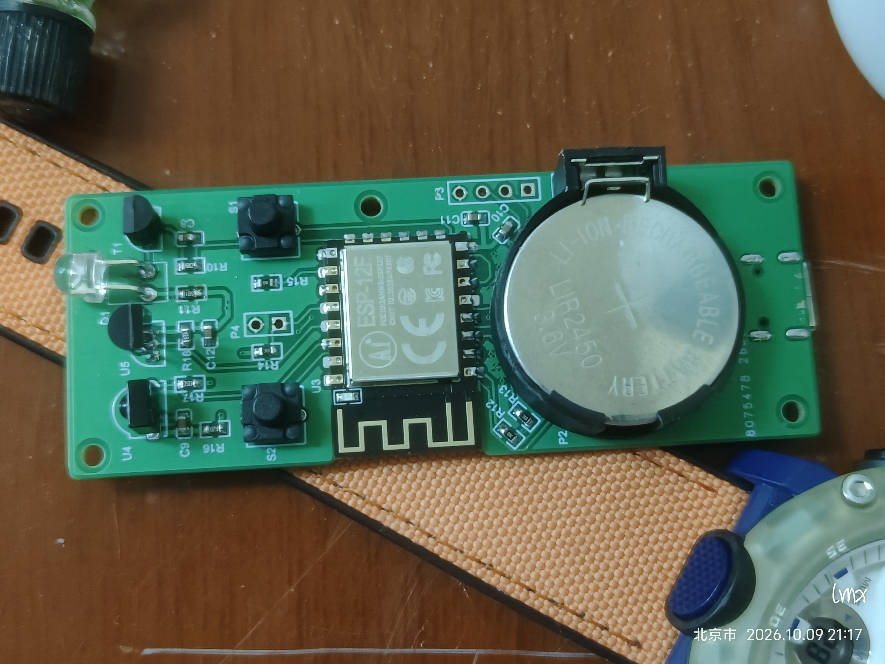
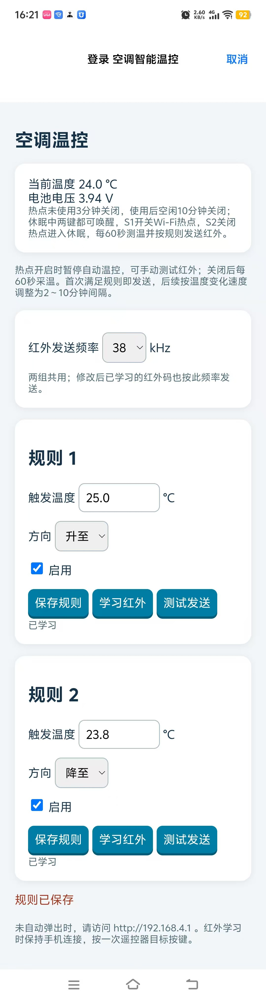

# 🌡️ 恒温养人控制器

> **空调负责干活，我负责让它懂事。**

一个基于 **ESP-12F** 的低功耗空调温控器。

它会自己测温、判断冷热、发送已经学会的遥控器指令。
不用 App，不连云端，配置完之后基本不用管。

## 能干什么

- 🌡️ DS18B20 自动测温
- 🎯 两组独立温控规则
- 📡 学习并发送空调红外指令
- 📱 手机连接 Wi-Fi 直接配置
- 💤 闲着就 light sleep，省点电
- 📈 温度变化越快，空调管得越勤

简单来说：

```text
太热了  → 发一个降温指令
太冷了  → 发一个升温指令
挺舒服  → 接着睡
```

## 怎么用

按 **S1** 开启热点，手机连接：

```text
空调智能温控
```

没有自动弹出页面时访问：

```text
http://192.168.4.1
```

设置温度 → 学习遥控器 → 测试发送 → 启用规则。

然后就可以把它扔在一边自己养人了。

## 实物图



## 配置页面



## 它什么时候工作

| 状态 | 行为 |
| --- | --- |
| 热点开启 | 每 2 秒测温，方便配置，暂停自动红外 |
| 正常运行 | 每 60 秒测温并检查规则 |
| 空闲期间 | 自动 light sleep |
| 温度变化明显 | 自动发送间隔按趋势调整为 120～600 秒 |

S2 可以快速关闭热点，但**不会停止温控**。

## 构建

```powershell
Set-Location .\Sof
python build.py
python flash.py --port COM3 --dry-run
```

以上命令从本工作区根目录执行；构建和测试在 `Sof` 目录执行，Git 管理根目录为 `D:\空调温度`。默认分段烧录保留未覆盖的 NVS。

如果已经学好了遥控器，别随手整片擦 Flash，不然它会把自己刚学会的东西忘掉。

## 当前状态

本次发布版本（新增修复尚未重新实机验收）：

```text
0.1K · 2026-10-10
```

2026-10-09 用户确认：红外与 1-Wire 波形、空调响应、真实休眠/功耗、温度准确度、手机弹页、ADC 多电压点及 24 小时运行均已完成实机验证。该状态依据用户反馈；本次未补充具体测量数值、设备镜像哈希或测量记录。

0.1K 发布附件包含：

**红外初始化错误检查 / 热点关闭失败重试 / 扩展回归测试 / PCB 与 BOM 资料**

保留 80 MHz、温度校准、60 秒采温和 120～600 秒趋势自动发送。本次纳入红外初始化错误检查、热点关闭失败重试及回归测试；此前实机确认不直接替代新增修复镜像的验收，详情见 [本地发布](Sof/README.md#本地发布)。

既有文档记录的低电流读数（对应镜像、测量接点与积分条件未确认）：

```text
3.994 V · 10 µA
```

该读数不作为当前构建的功耗验收结果；仅凭 light sleep 配置不能确认整机电流或续航。当前软件检查与用户实机验证确认见 [本地发布](Sof/README.md#本地发布)。

## 文档导航

- [项目说明与软件检查](Sof/README.md)
- [硬件引脚与接线](Sof/ESP-12F硬件引脚与链路说明.md)
- [编译环境](Sof/ESP8266编译环境路径.md) · [烧录工具](Sof/tools/README.md)
- [功耗验收](Sof/README.md#功耗验收) · [温度校准](Sof/README.md#温度测量与校准)

本项目根目录为 `D:\空调温度`：`Sof` 为固件与测试，`Ad` 为硬件设计，`dxf-pdf` 为元件资料与 DXF 文件。

## 下载与许可

- [GitHub 仓库](https://github.com/Limx1994/esp8266-ac-thermostat)
- [0.1K Release](https://github.com/Limx1994/esp8266-ac-thermostat/releases/tag/v0.1K)：分段烧录包、完整镜像及 SHA256 校验清单。保留规则和红外编码时使用分段烧录；完整镜像会清除 NVS。
- 项目采用 [PolyForm Noncommercial 1.0.0](LICENSE)，附带第三方工具保留其原有许可。

---

**目标就一个：**

> 少折腾空调，多养养人。
